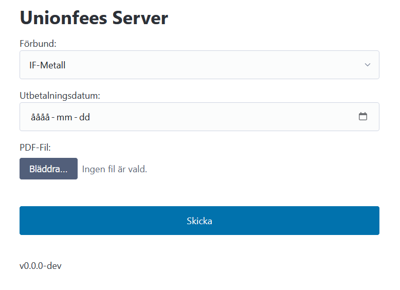

# UnionFees
Gör om pdf från **Visma Lön** till **IF-Metalls** datafil för import av fackavgifter.
Går att köra i kommandorad eller som webserver.

Detta program har inget stöd eller på något annat sätt koppling till Visma eller Visma Lön.
Det är en helt oberoende lösning på en brist som flera personer uppfattar att Visma Lön har.

- Källkod och annat hittar du på https://github.com/kmpm/unionfees.
- Senaste versionen kan du ladda ner från https://github.com/kmpm/unionfees/releases/latest
- Senaste docker image hittar du på `ghcr.io/kmpm/unionfees:latest`


OBS! All användning sker på egen risk.


## Bakgrund
HR avdelningen redovisar fackavgifter till IF-metall varje månad.
Ur Visma Lön kan man få ut en pdf-fil med all information som behövs men denna
går inte att importera hos IF-Metall utan måste göras om till ett textbaserat format.

Som referens se diskussion på vismas forum https://forum.spiris.se/t5/Fragor-om-lonehantering/Redovisning-av-fackavgifter/m-p/210782


## Build
Installera go>= 1.24 och task från https://taskfile.dev

```shell
task 

```

## Användning

### Kommandorad
```powershell
.\out\unionfees-cli.exe -d 211125 test.pdf
```

För att visa hjälp
```powershell
.\out\unionfees-cli.exe -h
Usage of unionfees.exe:
  [flags] <filename.pdf>
Flags
  -d string
        utbetalningsdatum ÅÅMMDD
  -m int
        redovisningsperiod MM
  -n string
        företagsnamn
  -o string
        organisationsnummer
  -print
        Visa det tolkade dokumentet
  -version
        Visa versionsnummer och avsluta
  -y int
        redovisningår ÅÅ
```


### Lite användarvänligare kommandorad
#### Förberedelser
1. Kopiera `unionfees-cli.exe` och [process.ps1](contrib/windows-cli/process.ps1) till samma mapp. Ex `C:\Program Files\unionfees`
2. Skapa en mapp där du vill bearbeta rapporterna. Ex. `Skrivbord\fackavgifter`
3. Skapa en genväg med `powershell.exe -noexit -ExecutionPolicy Bypass -File "C:\Program Files\unionfees\process.ps1"`
4. Sätt genvägens "Starta i" till `Skrivbord\fackavgifter`


#### Köra
1. Spara __1__ pdf-fil i `Skrivbord\fackavgifter`
2. Dubbelklicka på den skapade genvägen.
3. Fyll i datum när du uppmanas. Tryck Enter.
4. Filen bearbetas och flyttas till `Skrivbord\fackavgifter\arkiv` när den är klar.
5. Den bearbetade filen hittar du i `Skrivbord\fackavgifter\Metallförbundet-ÅÅMM.txt`


### Webserver
Webserver kan man köra på 2 sätt. Antingen köra `unionfees-server` direkt eller i en docker-container.

#### Direkt
```powershell
./out/unionfees-sever.exe 

```

#### Docker
```powershell
docker run -p 8080:8080 ghcr.io/kmpm/unionfees:latest

```


