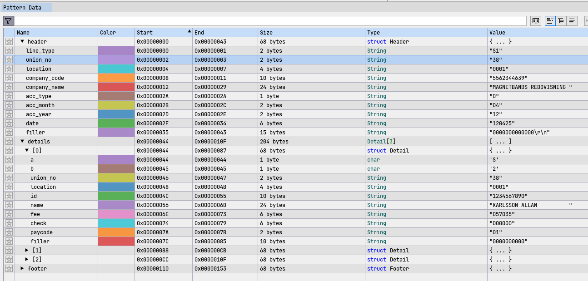

Detta program är bara testat för IF-Metall men GS verkar ha liknande format. 
Det är i stort sett bara betalkoder som är annorunda

## Formatspecifikationer

- [IF-Metall](./Fillayout%20för%20återredovisning%20av%20dragna%20medlemsavgifter.pdf)
- [GS Facket](https://www.gsfacket.se/globalassets/dokument/arbgiv/filbeskrivning-innehallet-i-en-fil.pdf)

## Validering
I filen `docs/ifmetall.hexpat`, finns en pattern-fil att använda med
programmet [ImHex](https://github.com/WerWolv/ImHex).

Detta kan ge dig en första ledtråd om och var det kan ha gått snett.

För respektive fack så finns det kontaktuppgifter för var man ska skicka fil för test.

## FAQ med IF-Metall

### Format på namn
Fråga: Personnamn, måste det vara i formatet ”Efternamn Förnamn”?

**Svar**: Ja så som vi har angett i specen är så vi vill att filerna ser ut. 

### Teckenuppsättning
Fråga: Textfil i ASCII-format duger inte som krav om man ska kunna använda namn med ÅÄÖ. I så fall måste man också veta vilken teckenkodning som ska användas då det finns flera. Helst skulle jag vilja använda UTF-8 men rätt kodad ASCII går bra. Vilken kodning ska det vara?

Svar: När det gäller formatet ANSI så är det svårt att förstå det hela. Men det jag kan säga är att vi inte kan läsa in UTf-8 idagsläget. Däremot så går det bar att läsa in  ISO-8859-1 eller Windows-1252 (vilket är väl samma som ANSI).
