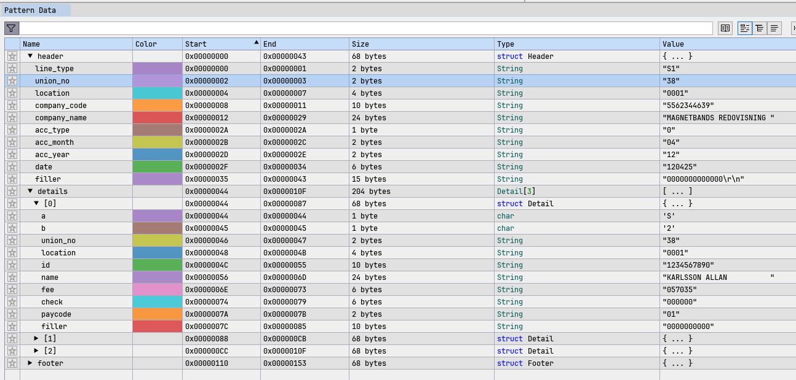

Detta program är bara testat för IF-Metall men GS verkar ha liknande format. 
Det är i stort sett bara betalkoder som är annorunda


## Formatspecifikationer

- IF-Metall: Kontakta avgifter@ifmetall.se
- [GS Facket](https://www.gsfacket.se/globalassets/dokument/arbgiv/filbeskrivning-innehallet-i-en-fil.pdf)

Textfil med ISO-8859-1 eller Windows-1252 som teckenkodning. Detta är viktigt för t.ex. namn med ÅÄÖ.
Den innehåller tre sorters posttyper, som varje rad börjar med - S1, S2 och S3
Varje post är 66 tecken (utan radmatning) lång och ska avslutas med `\r\n` ( hex 0x0D 0x0A).
Bara versaler ska användas i t.ex. namn.

__S1__ - Inledningspost, som ska innehålla uppgifter som arbetsgivare, period, utbetaldningsdag

__S2__ - Detaljposter, med medlemsuppgifter och belopp

__S3__ - Avslutningspot, innehåller totaler som antal poster, summerad avgift.

Posterna ska komma i ordning S1,S2...S2, S3 för varje arbetsgivare.
Om ni har flera arbetsställen och ska redovisa dessa i samma fil så ska det vara en S1 post
sen alla S2 poster och en S3 post för varje arbetsställe.

__Datatyper__
| Typ       | Kommentar                                         |
|-----------|---------------------------------------------------|
| alfanum   | Vänsterställt, versaler, fyll ut med blanksteg    |
| num       | Högerställt, 0-utfyllt.                           |
| valuta    | Som numeriskt men de 2 sista tecknen är ören      |


OBS! Det går inte att redovisa negativa belopp i filen. Om ni har en avvikelse från listan som inte
kan anges i filen, t.ex. personer som är tjänstlediga eller har slutat på företaget (dessa kan
dock anges med koder) fyll i dessa i kommentasfältet i respektive portal.

### Inledningspost S1
| Fält                      | Längd | Typ      | Kommentar                 |
|-------------------------  |-------|----------|---------------------------|
| Posttyp                   | 2 tkn | alfanum  | S1 (Alltid S1)            |
| Förbundsnummer            | 2 tkn | num      | (se nedan)                |
| Arbetsställenummer        | 4 tkn | num      |                           |
| Arbetsgivarnummer         | 10 tkn| num      |                           |
| Arbetsgivarens namn       | 24 tkn| alfanum  | fyll ut med blanksteg     |
| Redovisningsperiodstyp    | 1 tkn | num      | 0                         |
| Redovisningsperiod        | 2 tkn | num      | Vilken månad det gäller   |
| Redovisningsår            | 2 tkn | num      | Vilket år det gäller      |
| Löneutbetalningsdag       | 6 tkn | num      | ÅÅMMDD                    |
| Filler                    | 13 tkn| num      | nollutfyllnad             |

__Förbundsnummer__
| Kod   | Förbund           |
|-------|-------------------|
| 38    | IF Metall         |
| 43    | GS                |

__Redovisningsperiodstyp__
| Kod   |                     |
|-------|---------------------|
| 0     | Allid hos IF-Metall |
| 4     | Alltid hos GS       |

### Detaljpost S2
| Fält                      | Längd | Typ      | Kommentar                                                      |
| ------------------------- |-------|----------|----------------------------------------------------------------|
| Posttyp                   | 2 tkn | alfanum  | S2 (Alltid S2)                                                 |
| Förbundsnummer            | 2 tkn | num      | (se inledningspost)                                            |
| Arbetsställenummer        | 4 tkn | num      |                                                                |
| Personnummer              | 10 tkn| num      |                                                                |
| Namn                      | 24 tkn| alfanum  | Efternamn Förnamn (fyll ut med blanksteg)                      |
| Avgift                    | 6 tkn | valuta   | 4 tkn för kronor 2 tkn för ören                                |
| Kontrollavgift            | 6 tkn | valuta   | Obs, anges endast om kontrollavgift redovisas. Annars nollor   |
| Betalkod                  | 2 tkn | num      |                                                                |
| Filler                    | 10 tkn| num      | nollutfyllnad                                                  |

OBS! IF Metall har inga kontrollavgifter så alltid 000000


__Betalkoder__
| Kod | Förbund     | Betydelse                 |
|-----|-------------|---------------------------|
| 01  | 38,43       | Betald avgift             |
| 03  | 38          | Tjänstledig               |
| 04  | 43          | Sjuk/F-ledig              |
| 08  | 38          | Annan orsak, sjuk, utb.   |
| 19  | 38,43       | Anställning upphör        |
| 33  | 38          | Fullmakt saknas           |


### Avslutningsport S3
| Fält                      | Längd | Typ      | Kommentar                          |
|---------------------------|-------|----------|------------------------------------|
| Posttyp                   | 2 tkn | alfanum  | S3 (Alltid S3)                     |
| Förbundsnummer            | 2 tkn | num      | (se inledningspost)                |
| Arbetsställenummer        | 4 tkn | num      |                                    |
| Arbetsgivarnummer         | 10 tkn| num      |                                    |
| Arbetsgivarens namn       | 24 tkn| alfanum  |                                    |
| Antalposter               | 6 tkn | num      |                                    |
| Summa medlemsavgifter     | 9 tkn | valuta   | 7 tkn för kronor, 2 tkn för ören   |
| Summa Kontrollavgifter    | 9 tkn | num      | 7 tkn för kronor, 2 tkn för ören   |


## Exempel
```
S13800015562344639MAGNETBANDS REDOVISNING 004121204250000000000000
S23800011234567890KARLSSON ALLAN          057035000000010000000000
S23800010987654321JOHANSSON EVERT         064000000000010000000000
S23800011122334455MARKLUND PETRONELLA     000000000000190000000000
S33800015562344639MAGNETBANDS REDOVISNING 000003000121035000000000
```

## Validering
I filen `docs/ifmetall.hexpat`, finns en pattern-fil att använda med
programmet [ImHex](https://github.com/WerWolv/ImHex).

Detta kan ge dig en första ledtråd om och var det kan ha gått snett.

För respektive fack så finns det kontaktuppgifter för var man ska skicka fil för test.


## FAQ med IF-Metall

### Format på namn
Fråga: Personnamn, måste det vara i formatet ”Efternamn Förnamn”?

**Svar**: Ja så som vi har angett i specen är så vi vill att filerna ser ut. 

### Teckenuppsättning
Fråga: Textfil i ASCII-format duger inte som krav om man ska kunna använda namn med ÅÄÖ. I så fall måste man också veta vilken teckenkodning som ska användas då det finns flera. Helst skulle jag vilja använda UTF-8 men rätt kodad ASCII går bra. Vilken kodning ska det vara?

Svar: När det gäller formatet ANSI så är det svårt att förstå det hela. Men det jag kan säga är att vi inte kan läsa in UTf-8 idagsläget. Däremot så går det bar att läsa in  ISO-8859-1 eller Windows-1252 (vilket är väl samma som ANSI).
